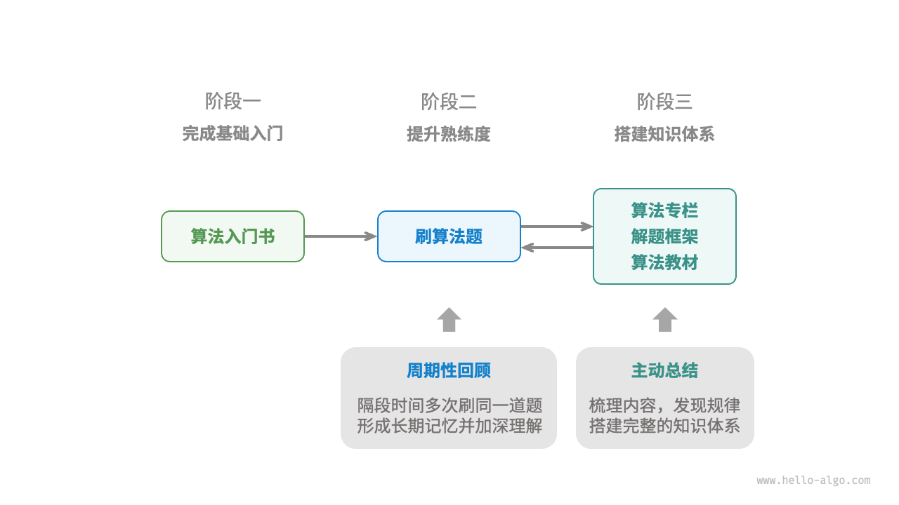

# Hello Algo Notes

> 本書的使用方式我個人覺得可以先把理論看一遍，把重點紀錄下來，然後再看 source code，把程式碼再走過一遍

+ ## 前言

   - 建議參照程式碼自行敲一遍，比起閱讀，實際撰寫才能帶來收穫。**動手學，才是真的學。**

   - 學習資料結構跟算法分為三個步驟，此書主要涵蓋第一階段。

      

      1. 算法入門：熟悉各種資料結構的特點跟用法，以及學習不同算法的原理、流程、用途、效率

      2. 刷算法題：從熱門題目開始，像是“[NeetCode](https://neetcode.io/)”、“[劍指Offer](https://leetcode.cn/studyplan/coding-interviews/)”、“[LeetCode Hot 100](https://leetcode.cn/studyplan/top-100-liked/)”，至少刷 100 題，熟悉主流的問題。之後要重複刷，直到牢記在心。

      3. 建構知識體系：閱讀算法教材、解題手法，不斷豐富知識體系，嘗試採用進階刷題策略，一題多解、一解多題、專題分類等等。

+ ## 初識算法

   - 算法無處不在，找零錢運用到算法（貪心算法）、查字典也運用到算法（二分查找）、排序樸克牌也算法算法（插入算法），過去你可能用大腦處理，自然而然的達成，但現在我們要將這些步驟交由電腦來處理，為了達到這個目的，我們需要明確的將步驟跟方法定義出來，讓電腦能夠理解，因此有了“演算法”的存在。

   - 算法（algorithm）定義：

      - **有限時間**內解決**特定問題**的**一組指令**或操作步驟

      - 問題是明確的，有清晰的輸入以及輸出

      - 具有可行性，可以在有限的時間、步驟、記憶體空間下完成

      - 每個步驟都有明確含義，在相同輸入、運行條件下，輸出始終相同

   - 軟體工程師的工作內容就是要將問題轉變成算法，要寫出算法，就必須滿足上面的條件，我們可以採用 [UMPIRE](https://app.heptabase.com/5f406da3-95af-4449-a85e-b9b0f1fede30/card/24ac906a-019e-4425-b180-bcb48cfcc7c9) 來協助我們思考

   - 資料結構（Data Structure）定義：

      - 電腦組織、儲存資料的方式

      - 有以下期望：

         - 空間佔用儘量少

         - 資料操作（CRUD）盡量快

         - 好理解，能夠表達資料的含義

      - 好的資料結構設計，就是好的權衡取捨，要時間換空間？空間換時間？還是可讀性優先？

   - 算法要操作資料結構，資料結構沒有算法沒辦法達成結果，兩者密不可分，為了達到最高的效率，**選擇最合適的資料結構，搭配最合適的演算法，才能有最好的結果**

   

+ ## 效率評估

   - 算法設計可以採用 **“先求有再求好”** 的設計原則

      - 有：符合限制條件的解方

      - 好：最高效的解決方法

   - 可以從兩個維度來評估算法是否“好”，目標是達到“又快又好”

      - 時間效率：運行的快慢

      - 空間效率：佔用的空間

   - 由於實際測試變因太多，所以主流是**理論估算（漸進複雜度分析，asymptotic complexity analysis，簡稱“複雜度分析”）**，也就是常聽到的 **“Big O”**

   - 複雜度分析定義：

      - **隨著輸入大小的增加，算法所需時間和空間的增長趨勢**

      - 有幾個重點：輸入大小、空間和時間、增長趨勢，也就是說，複雜度分析想要知道的是「當我今天數據量從很小增長到很大，我的算法所需要的空間在這個小到大的過程中，佔用資源的變化為何？」

   - 計算時間資源稱為「**時間複雜度 Time Complexity**」，計算空間資源稱為「**空間複雜度 Space Complexity**」

   - 算出時間、空間複雜度之後，我們就可以評估一個算法是否又快又好，並且可以跟其他算法做比較，來看哪個比較適合

   

+ ## 迴圈（iteration）

   - 定義：重複執行某個任務的控制結構，只要滿足特定條件就不斷執行，直到無法滿足條件

   - `for` ：適合預先知道迴圈次數時使用

   - `while`：自由度更高，可以設計變數初始化跟更新步驟

+ ## 遞迴（recursion）

   - 定義：透過調用函數自己來解決問題

   - 遞：不斷呼叫自己，傳入更小或簡化的參數，直到達到“終止條件”

   - 迴：觸發“終止條件”，從最深層開始返回，並匯聚每一層的結果

   - 三個要素

      - 終止條件：決定什麼時候從 ”遞“ 轉 ”迴“

      - 遞迴調用：呼叫自己，傳入更小、簡化的參數

      - 返回結果：將結果開始返回至上一層

   - Call Stack

      - recursion 每次呼叫自己，系統都會為新開啟的函數分配記憶體，用來儲存該函數的參數、局部變數、呼叫地址、返回地址、其他資訊等，這些資訊會被包裹成一個「Stack Frame」

      - recursion 呼叫的次數越多，Stack Frame 就會越多，佔用的記憶體也會越多，而這些 Stack Frame 都會儲存在 Call Stack 裡面，直到返回時才會 FILO 的開始釋放

      - 由於上述額外開銷的關係，通常 Recursion 會比 Iteration 更花時間跟空間

      - 語言都有其 Recursion 深度，若超出就會出現 Stack Overflow，以 Go 來說限制為 1000000000-byte（1GB）

   - 尾遞迴（tail recursion）

      - 如果函數在返回前的最後一步才進行遞迴呼叫，該函數可以被compiler or interpreter 優化，使其空間效率跟 iteration 差不多

      - 遞迴呼叫是最後一步，代表函數返回時沒有其他操作要處理，所以上一層不需要儲存上下文，因此可以省下空間

      - 不過就我所知 Python、[Go](https://yushuanhsieh.github.io/post/2019-06-22-tail-recuriosn-optimization/)、Rust 都沒有提供

   - 遞迴樹

      - 以 Fibonnaci 為例，在每次執行都會產生兩個呼叫分支，產生「遞迴樹 Recursion tree」

      ```go
      func fib(n int) int {
        if n == 0 || n == 1{
          return n
        }
        return fib(n - 1) + fib(n - 2)
      }
      ```

      

+ ## Iteration v.s. Recursion

   - 都可以解決問題，但兩者代表不同的思路跟解決問題的方式

   - Iteration：自下而上，重複最基礎的步驟，直到完成

   - Recursion：自上而下，將原問題分解為小問題，直到拆解成基本情況（解是已知的情況）時停止，而小問題跟原問題具有相同的形式

   - 在 CS 中，一切都是 Depends on，根據情況選擇你的解法，在權衡取捨時間、空間、可讀性之後，找出最合適的解法，這就是考驗軟體工程師的實力的時候

+ ## 時間複雜度

   - 大 O 記號（big-$O$ notation）是函數 $T(n)$ 的漸進上界（asymptotic upper bound），同時也是“最差時間複雜度”

   

   - 最佳時間複雜度符號為 $Ω$（Omega）

   - 平均時間複雜度符號為 $Θ$（Theta）

   - 時間複雜度由  $T(n)$ 中最高階的項來決定，因為當 $n$ 無限大時，最高階的項將主導，其他項的影響可以忽略

      

   - Constant 常數階 $O(1)$

      - 與輸入數據大小 $n$ 無關

   - Linear 線性階 $O(n)$

      - 與數入數據大小 $n$ 以線性關係增長，通常出現在單層循環

   - Quadratic 平方階 $O(n^2)$

      - 與數入數據大小 $n$ 以平方關係增長，通常出現在嵌套循環

   - Exponential 指數階 $O(2^n)$

      - 每輪都一分為二，就跟細胞分裂一樣

      

   - Logarithm 對數階 $O(log\ n)$

      - 每輪都縮減一半

      

   - 線性對數階 $O(n\ log\ n)$

      - 嵌套循環，一層為 $O(log\ n)$、一層為 $O(n)$

      

   - 階乘階 $O(n!)$

      

+ ## 空間複雜度

   - 衡量佔用的記憶體空間隨著數據量變大時的增長趨勢

   - 算法在運行過程中使用的記憶體空間有幾種：

      - 輸入空間：儲存輸入數據

      - 暫存空間：儲存運行過程中的變數、物件、函數上下文等等

      - 輸出空間：儲存輸出數據

   - 一般來說，空間複雜度是計算“暫存空間”跟“輸出空間”

   - 暫存空間分為三個部分：

      - 暫存資料：保存算法運行過程中的常數、變數、物件等

      - Stack Frame：保存呼叫函數的上下文資料

      - 指令空間：保存編譯後的程式指令，通常忽略不計

   

   - 我們通常只關注最差空間複雜度，因為我們要確保資料不能超過記憶體空間

   

   - 以算法運行中的峰值為準

   - 常數階 $O(1)$

      - 與數據大小 $n$ 無關的常數、變數、物件

   - 線性階 $O(n)$

      - 與數據大小 $n$ 成正比，array、list、stack、queue 等

      

   - 平方階 $O(n^2)$

      - 常見於矩陣、圖，與 $n$ 成平方關係

      

   - 指數階 $O(2^n)$

      - 常見於二叉樹

      

   - 對數階 $O(log\ n)$

      - 常見於分治算法

+ ## 資料結構

   - 邏輯結構：線性與非線性

      

   - 物理結構：連續與分散

      - 系統透過記憶體位置來訪問目標位置的資料

      

      - 連續空間儲存（Array）和分散空間儲存（Linked List）

      

   - 物理結構決定了我們的使用方式，雖然我們有很多資料結構可以選用，但現實上，所有資料結構其實都是 Array、Linked List、或是兩者的組合實現的

   - 物理結構決定了我們 CRUD 操作的速度

   - 基於 Array 實現的稱為「靜態資料結構」，此類長度不可變

   - 基於 Linked List 實現的稱為「動態資料結構」，此類的長度可變

+ ## 基本資料型態

   - 基本資料型態是 CPU 可直接進行計算的類型

      - 整數：`byte`、`short`、`int`、`long`

      - 浮點數：`float`、`double`

      - 字符：`char`

      - 布林：`bool`

   - 基本資料型態以二進制的方式儲存在記憶體中，一個二進制位 = 1 bit，8 bits = 1 byte

   - 不過在使用上，就算是使用 `bool` 也不是分配 1 bit ，而是分配 1 byte，因為現代 CPU 通常將 1 byte 作為最小尋址記憶體單元

   - 基本資料型態決定了資料的“內容”，而資料結構決定了“內容”是如何“組織”在一起的

+ ## Array

   - Array 需要連續的記憶體空間，且元素必須為同一類型，這需要大量的先驗資訊來換取操作效率

   

   - 索引的本質是記憶體位址的偏移量，所以訪問速度是 $O(1)$

   

   - 插入：將所有在插入位置之後的元素都往後移動一位，然後將元素插入該位置

   

   - 刪除：將索引之後的元素都往前移動一位

   

   - 搜尋：線性查找，$O(n)$

   - Array 的插入跟刪除平均時間複雜度為 $O(n)$

   - Array 的長度是不可變的，因為不確定 array 擴容之後是否還有足夠的空間容納，array 擴容要找到足夠長的空間，然後將舊的 array 的內容搬移到新的 array 去，這是 $O(n)$ 操作

   - 優點：

      - 空間效率高：分配連續的記憶體空間，無需額外的開銷

      - 支持隨機訪問：$O(1)$ 訪問任何元素

      - 緩存局部性：訪問 array 元素時，其周遭的元素也會被緩存，以此加速後續操作的執行速度

   - 缺點：

      - 插入、刪除效率低：$O(n)$，當遇到大量資料要移動時，開銷很大

      - 長度不可變：若要擴容，就需要尋找空間並移動資料，開銷很大

      - 空間浪費：array 分配的大小若大於實際所需，多餘的空間就會被浪費

+ ## Linked List

   - linked list 是一種線性資料結構，每個元素都是一個節點，每個節點透過”引用“相連。引用紀錄下一個節點的記憶體位置，透過引用我們可以從當前的節點找到下一個節點。

   - linked list 可以讓我們使用不連續的記憶體空間

      

   - 節點（Node）是由兩個資料組合合成的，一個是節點的數值，一個是指向下一個節點的引用

   - linked list 的首個節點稱為 head node，最後一個稱為 tail node

   - tail node 指向的是空節點，Python 中記為 `None` 

   - 在支援指針的語言像是 Go、Rust，上述的引用應該被替換成指針

   - linked list 除了包含數值本身，還需要額外保存一個指針，所以在相同數據量的情況下，linked list 使用的記憶體空間是大於 array 的

   - 我們通常會將 head node 當作 linked list 的代稱，舉例來說：有一個 linked list 的 head node 叫做 `Hello`，那我們就會稱此 linked list 叫做 `Hello`

+ ## Linked List 常用操作

   - 初始化 linked list

      - 建立 linked list 有兩個步驟，第一步是初始化各個節點，第二步是將所有節點串連起來。初始化完成之後，我們就可以從 head node 將整個 linked list 遍歷。

   - 插入節點

      - 插入節點只需要改變插入位置前後的兩個節點就可以，時間複雜度 $O(1)$，相對 array 的插入 $O(n)$ 來說更為高效

      

   - 刪除節點

      - 刪除節點只需要將原本指向該節點的指針改掉就可以了

         

      - 雖然說該節點依舊存在，但 linked list 已經訪問不到了，所以也算是刪除，以有 GC 的語言來說，GC 會將沒有使用到的空間清除，所以該 Node 應該會之後被清除

   - 訪問節點

      - 在 linked list 要訪問節點，必須要從頭遍歷，在最差的情況下，如果搜尋的節點是最後一個，那就會是 $O(n)$ 的時間複雜度

   - 查找節點

      - 從頭遍歷 $O(n)$ 的時間複雜度

   

   

+ ## 常見 Linked List 類型

   - Singly linked list：每個節點包含值跟指向下一個節點的指針。常用於實現 Stack、Queue、Hash table、Graph 等等

      - Stack：透過將插入和刪除的操作都限制於其中一端來達成

      - Queue：插入跟刪除分別作用在不同的一端，形成一個入口，一個出口，達到 FIFO 的特性

      - Hash table：在 [Closed Addressing](https://programming.guide/hash-tables-open-vs-closed-addressing.html) 中，每個 index 都是一個 linked list 的 head node，當 [Hash collision](https://en.wikipedia.org/wiki/Hash_collision) 時，元素會被存放在該位置的 linked list 的 node 中

      - Graph：[adjacency list](https://www.programiz.com/dsa/graph-adjacency-list) 是 graph 一種常見的實現，每個 vertex 背後都是一個 linked list，紀錄跟該 vertex 有關的元素（adjacent vertices）

   - Circular linked list：tail node 連接到 head node，形成循環，這時候每個節點都可以作為 head node。常用在週期性操作的場景。

      - Round-Robin Scheduling：一種常見的 CPU scheduling algorithm，對一組 process 進行循環，每個 process 賦予一個時間段，當時間用完時，CPU 會切換到下一個 process

      - Data Buffer：音樂、影片播放器，為了能夠無縫播放，會將 data strem 分成多個 buffer 放入一個 circular linked list 來無限循環

   - Doubly linked list：每個節點指向下一個節點跟上一個節點，雙向的 linked list 更靈活，但也需要更多記憶體空間。常用於需要快速查前一個跟後一個的場景。

      - 高級數據結構：[red-black tree](https://www.geeksforgeeks.org/introduction-to-red-black-tree/)、B tree，我們 access node 的 parent node，可以透過在 node 中保存一個指向 parent node 的 pointer 來實現

      - browser 歷史：用戶 click 上一頁、下一頁時，browser 需要知道 user access 過的前一個網頁跟後一個網頁

      - [LRU（Least Recently Used Cache）](https://josephjsf2.github.io/data/structure/and/algorithm/2020/05/09/LRU.html)：請參考[連結](https://josephjsf2.github.io/data/structure/and/algorithm/2020/05/09/LRU.html)中的實現

   

+ ## List

   - list 是一種抽象的資料結構，他表示元素的有序集合，而且內建擴容機制，使用者無須考慮容量限制

   - list 可以透過 array 跟 linked list 實現，但常見的是使用 array 實現，所以也稱為「dynamic array」

+ ## List 常見操作

   - 初始化列表，有 ”有初始值“ 跟 “無初始值” 兩種方式

   - 訪問：背後是 array，可以 $O(1)$ 訪問和更新元素

   - 插入跟刪除：可以自由添加和刪除，如果是尾部添加為 $O(1)$，插入跟刪除則跟 array 一樣是 $O(n)$

   - 遍歷：可以索引遍歷，也可以直接遍歷，跟 array 操作方式一樣

   - Extend：可以將兩個 list 合併再一起

   - Sort：支援排序，目前常見的為 Timsort、pdqsort

+ ## List 簡易實現

   - 主要有三個重點

      1. 初始容量：如何選擇合適的初始容量，盡量避免佔用過多空間

      2. 數量紀錄：用來記錄當下的使用量，需要隨著變化而同步更新

      3. 擴容機制：若超出容量就必須擴容，但要擴大多少數量是一門學問

   

+ ## Stack

   

   - 具有 FILO 的特性

   - Stack 的入口（最上面）稱為 “the top of the stack”，Stack 的底部（最下面）稱為 “the bottom of the stack”

   - 把元素（element）添加到 Stack 稱為 “push”，刪除元素稱為”pop”

   - Stack 提供三種操作

      - ”pop”：移除元素，$O(1)$

      - ”push”：添加元素，$O(1)$

      - ”peek”：查看底部元素，$O(1)$

+ ## Stack 的實現

   - Stack 在實現上要遵守 FILO，所以只能在同一側添加跟刪除元素

   - 可以將 Stack 視為一種受限制的 array 或 linked list，所以實現上我們只要將 array 或 linked list 的部分操作隱藏就可以邏輯上實現

   - 基於 linked list 的實現，可以參考下圖，這作法稱為“頭插法（insert at head）”

      - pros: 不需處理擴容的問題

      - cons: 

         - 需要初始化節點以及修改指針，效率相對較低

         - 需要額外的空間給指針

      

      

      

   - 基於 array 的實現，我們可以將 array 的尾部當作 the top of the stack，pop 跟 push 都作用在尾端，時間複雜度是 $O(1)$。為了應對元素可能超出 array 的 capacity，我們可以使用 list，就不用處理 array 擴容的問題

      - pros: 緩存支持，效率較高

      - cons: 

         - 擴容時時間複雜度會來到 $O(n)$

         - 分配但沒用到的空間會造成浪費

      

      

      

+ ## Queue

   - FIFO，就像排隊一樣，先到的人先處理

      

   - 加入隊列稱為”Enqueue”，操作常稱為 “push”

   - 離開隊列稱為”Dequeue”，操作常稱為 “pop”

   - Queue 的尾部，用來添加新元素的稱為 “the back, tail, rear of the queue”

   - Queue 的頭部，用來移除元素的稱為 “the head or front of the queue”

   - Queue 提供三種操作

      - ”pop”：移除元素，$O(1)$

      - ”push”：添加元素，$O(1)$

      - ”peek”：查看底部元素，$O(1)$

+ ## Queue 實現

   - 要滿足 FIFO，可以在一端添加元素，另一端刪除元素，array 跟 linked list 都可以做到

   - 基於 linked list 的實現，head node 用來移除節點，tail node 用來添加節點

      

      

      

   - 基於 array 的實現，在 array 中要刪除首個元素的時間複雜度是 $O(n)$，這會導致 Dequeue 的效率極低，為了解決這個問題，我們可以用一個變數 `front` 指向 queue 的第一個元素，然後用一個變數 `size` 用來記錄 queue 的長度，`rear = front + size` ，這樣就可以知道 queue 的結尾在哪

      - Enqueue：將元素賦值給 `rear` 索引處，並將 `size` 增加 1，$O(1)$

      - Dequeue：將 `front` 增加 1，將 `size` 減少 1，$O(1)$

      - 為避免 `front` 跟 `rear` 超出索引範圍，我們可以設計一個機制，當索引在抵達底部時回到起始點，形成“circular array”的樣子，這可以透過“取餘”來達成

      

      

      

+ ## Double-ended queue

   

   - Deque 有更高的靈活性，頭跟尾部都能夠添加跟移除元素

   - Deque 提供多種操作，但不外乎就是添加、刪除、訪問

      - push_first：將元素添加至隊首，$O(1)$

      - push_last：將元素添加至隊尾，$O(1)$

      - pop_first：刪除隊首元素，$O(1)$

      - pop_last：刪除隊尾元素，$O(1)$

      - peek_first：訪問隊首元素，$O(1)$

      - peek_last：訪問隊尾元素，$O(1)$

   - Deque 可以做到 Queue 跟 Stack 的操作，適用於 Queue 跟 Stack 的場景，並提供額外的功能，有更高的自由度

+ ## Deque 實現

   - 使用 linked list 實現，我們可以使用 doubly linked list

      

      

      

      

      

   - 使用 array 實現，也可以透過 circular array 的思路來解決

      

      

      

      

      

+ ## Hash Table

   - Hash Table 建立 key 跟 value 直接的映射，這種映射關係是 1 對 1 的，也就是一個 key 只會找到一個 value

      

   - Hash table 的 CRUD 操作都十分高效，時間複雜度是 $O(1)$

   - hash table 是透過輸入 key 進入 hash 函數來計算出索引位置，hash 函數的計算過程大致分為兩步

      > index = hash(key) % capacity

      1. 傳入 key 並使用 hash 演算法計算出 hash value

      2. 將 hash value % capacity 得到索引位置

      然後再將 key 跟 value 儲存在計算出來的索引位置

      

+ ## Hash Table 的簡易實現

   - 先假設最簡單的情境，這個 Hash table 只能接受資料型態是 int 的 key ，所以我們可以將輸入的 key 拿來直接取餘計算找出要存放的索引位置，且暫時不考慮 hash collision

   - 由於需要隨機訪問，我們使用 array 來實現，每個 key 會佔用 array 的一個空位，這個空位被稱為「bucket」，每個 bucket 可以儲存一個 key-value pair，搜尋上我們是找到這個 key 對應的 bucket，然後查看他的 value

+ ## Hash Collision

   - Hash 函數在做的事是將大空間的數值映射到有限的小空間，所以在理論上會有碰撞的風險，而這個碰撞就稱為「Hash Collision」

      

   - 當輸出的空間越大，碰撞的機會就越小，這個很好理解，你可以想像你要放置東西到櫥櫃中，那這個櫥櫃當然越大越好，越大的空間放東西就越不會東西必須擠在一起，回到 hash table，我們可以透過 resize 來擴大輸出空間來減少  hash collision 的機率

      

   - Hash table 的 resize 除了要找到夠大的空間將數值搬過去（就像 array 做的那樣），還需要重新計算每個 key 的索引，又更加的耗時，所以一般程式語言會保留足夠大的空間避免觸發 resize 

   - load factor: 用來計算 resize 的時機點，定義為

      ```go
      load factor = hash table 的 element 數量 / bucket 的數量
      ```

      如果超出一個 threshold 就會觸發 resize，而具體來說會 resize 多少空間，這就取決於語言的實現了

   - 雖然上述的 resize 簡單粗暴但效率實在太差，所以對於避免 hash collision 還有優化的方向：

      1. 改良 hash table 的資料結構，讓它遇到 collision 也可以正常運作。衍生出兩種做法 separate chaining 跟 open addressing

      2. 除非 collision 的情況嚴重，不然不執行 resize

   ### Separate Chaining

   - 每個 bucket 都是一個 linked list，然後將 head node 儲存在 index 位置，collision 時就儲存在這 linked list 下，當然，這個 linked list 會有長度限制，以 Go 語言來說，這個長度是 8，超出 8 之後的元素都會被放到 collision bucket，直到這個 bucket 的容量達到 load factor 才會觸發 resize

      

   - 搜尋：先透過索引找到 head node，然後遍歷 linked list 找到 key

   - 添加：添加元素到索引位置的 linked list 下

   - 刪除：先執行搜尋，然後再執行刪除

   - Cons

      - 額外指針：因為使用 linked list 的關係，佔用的空間會比 array 大

      - 查詢效率低：當遇到衝突時，需要遍歷 linked list 來搜尋 key

   ### Open Addressing

   - 透過“重複查詢”來處理 hash collision

   - 包括多種做法：Linear Probing、Quadratic Probing、Double Hashing 等等

   - Open Addressing 的作法都存在不能直接刪除元素的問題，這可以透過「lazy deletion」來解決

   #### Linear Probing

   

   - 當發生 hash collision 時，會採用固定步長往後來進行搜尋

      - 插入：從衝突索引處往後搜尋，每次移動固定步長，直到找到 empty bucket，然後將元素插入

      - 查找：從衝突索引處往後移動固定步長不斷搜尋，如果搜尋到了，則返回；若搜尋不到，再遇到 empty bucket（代表不存在） 之前不會停止

   - Linear Probing 容易發生 ”聚集現象“，也就是說當 array 中被連續佔用的空間越多，就越可能發生 hash collision，進而佔用連續空間，導致 hash collision 機率變高，造成惡性循環

   - 在 Open Addressing 中，我們是不能直接刪除元素的，這會導致搜尋元素遇到 empty bucket 而中斷，

      

      取而代之，我們採用「lazy deletion」的技巧，透過用一個 constant（常量）`TOMBSTONE` 來取代刪除過的元素，這樣在搜尋時便可以知道我們要繼續往下，而不是停止於此。 不過在插入上，我們可以直接將`TOMBSTONE` 視為 empty bucket，並插入於此，而不是像搜尋一樣跳過。

   - Lazy deletion 可能會加速 hash table 的性能退化，由於 `TOMBSTONE` 的增加，搜尋時間也會變長，因為必須跳過多個標記才能找到元素。為此，我們可以在插入跟查詢元素時，記錄遇到的第一個 `TOMBSTONE`，並且在搜尋到元素時，將該元素跟`TOMBSTONE` 交換位置，這樣就能大幅加快下次搜尋的速度

   #### Quadratic Probing

   - 跟 linear probing 異曲同工之妙，不過不是移動固定步長，而是移動“探測次數的平方步長”（1, 4, 9, 16….）

   - 有以下優點：

      - 跳過距離非固定，可以緩解 linear probing 的聚集效應

      - 跳過的距離更大，可以讓資料分布的比較平均

   - 但仍有以下隱憂：

      - 仍然會發生“聚集現象”，某些位置的佔用機率比其他位置高

      - 由於平方增長，可能不會探測到整個 hash table，代表即使有 empty bucket 也找不到

   #### Double Probing

   - 使用多個 hash function 進行探測

   - 插入：若 $f(x)$ 遇到衝突，則嘗試 $f_2(2)$ ，依此類推，直到找到 empty bucket

   - 查詢：用相同順序的 hash function 進行搜尋，直到找到目標則返回，若遇到 empty bucket 或所有 hash function 都嘗試一輪還是沒有找到，則返回 None

   - 不容易發生“聚集現象”，但計算量也比較大

+ ## Hash Algorithm

   - 要避免 hash collision 除了調整資料結構，像是採用 Separate Chaining 或是 Open Addressing 的作法，另外就是要從 hash function 上下功夫。

   - 在最差的情況下，有可能每個 key 計算都是同一個索引位置，導致時間複雜度退化到 $O(n)$

      

   - hash 算法在設計上有以下目標：

      1. 確定性：相同輸入應該要有相同輸出

      2. 效率高：計算開銷越快越好

      3. 均勻分布：讓 key-value pair 能夠平均分配

   - hash 還可以用於其他場景，如以下：

      - 密碼儲存：為避免密碼洩漏，使用者的密碼將會計算成 hash 之後儲存，而不是直接儲存明文。驗證上只要輸入的 hash 跟資料庫儲存的 hash 相匹配即可。

      - 資料完整性驗證：為了確保收到完整的資料，我們可以傳送原始資料的 hash 值，接收方則可以自行計算資料的 hash 值是否與原始的一致，若一致則表示該資料是完整的。

   - hash 也可以用在密碼學場景，但除了確定性、效率高、均勻分布外，還需要達成更多條件才能達到安全：

      1. 單向性：不能夠從 hash 反推資料

      2. 抗碰撞性：極難找到兩個 hash 一樣的輸入

      3. 雪崩效應：輸入只要有些微的改動，hash 就會變成截然不同的樣子，讓人不可預測

   - “均勻分布”跟“抗碰撞性”是兩個不同概念，舉例來說： `key % 100` 可以達成均勻分布，但要找到兩個 hash 一樣的輸入，我們只要找到後兩位相等的 key 即可以破解，這樣便沒有滿足抗碰撞性。

   - 在 hash 計算中，會使用“很大的質數”作為模數，可以最大化 hash 的均勻分布，因為質數與其他數字之間沒有公約數，可以減少因 mod 計算產生的週期性模式，避免 hash collision

   - 以下是詳細說明

      

   - 不同資料類型有不同的 hash 計算方式，以 Python 舉例來說：

      - int、boolean 其本身就是 hash

      - float 跟 string 計算上比較複雜

      - tuple 是其中的每個元素都計算 hash，然後再組合起來

      - object 是基於記憶體位置生成。也可透過改寫其 hash 方法改由用其內容來生成。

   - 在很多程式語言中，只有不可變的物件才能作為 key，因為可變的物件會隨著改變破壞原本計算的 hash

   - 自定義的物件雖然內容可變，但只要確保其記憶體空間不變，就可以作為 key 使用

   - Python 的 interpreter 每次啟動都會為 string 的 hash 函數添加隨機 salt 值，可避免 HashDos 攻擊

+ ## 常見的 hash algorithm

   

+ ## Binary Tree

   

   - Binary Tree 的基本單位是節點，節點包含

      - 值

      - left-child node 引用

      - right-child node 引用

   - 節點有衍生節點的稱為「Parent Node」，右邊的衍生節點稱為「Right-child node」，左邊的則為「Left-child node」，而「Right-child」後續衍生的樹又稱「right subtree」，左邊的則稱「left subtree」

   - 在 binary tree 中，除了「leaf node」以外的 node 都具有「child node」跟「non-empty subtree」

   

   - binary tree 常用術語：

      - Root Node：binary tree 頂層的節點，沒有 Parent Node

      - Leaf Node：沒有 child node 的 node

      - Edge：連結兩個 node 的指針

      - Height：Root 到最遠 node 的 edge 數量

   - 描述 node 的術語

      - 節點的 Level：Root Node 所在位置為 Level 1，依序往下 Level 2、Level 3…

      - 節點的 Degree：該 node 的 child node 數量

      - 節點的 Depth：Root node 到此節點經過的 edge 數量

      - 節點的 Height：該節點到最遠的 leaf node 經過的 edge 數量

   - 在 binary tree 中若刪除 node，則 node 底下的 subtree 也會跟著刪除，在實作上要注意

+ ## 常見的 Binary Tree

   - Perfect Binary Tree

      - Leaf node 的 degree 為 0

      - 其餘所有 node 的 degree 為 2

      - 樹的 level 為 $n$，則總節點數為 $2^n+1$

      

   - Complete Binary Tree

      - 只剩底層 node 沒有被填滿，心法：靠左對齊

      

   - Full Binary Tree

      - Full：全滿，大家 degree 都是 2

      

   - Balancde Binary Tree

      - 任意 left subtree 跟 right subtree 的高度的絕對值不超過 1

      

   - 最理想的情況下，binary tree 可以發揮一分為二的優勢，但在最差的情況下會退化成 linked list，這時所有操作都會退化成 $O(n)$

      

   

+ ## Binary Tree Traversal

   - Binary tree 常見有四種 traversal 方式，而此四種又可以歸類成兩大類

      - Depth-First Search, DFS：深度優先，先走到底再回頭

         

         - Pre-Order Traversal：訪問的當下就記錄自己

         - In-Order Traversal：記錄過 left subtree 之後再紀錄自己

         - Post-Order Traversal：記錄過 left & right subtree 之後再記錄自己

         - 時間複雜度 $O(n)$：每個節點都必須看過一次

         - 空間複雜度 $O(n)$：在最差情況下，tree 退化成 linked list，這時遞迴深度來到 $n$，因此需要 $O(n)$ stack frame 空間

      - Breadth-First Search, BFS：廣度優先，一層一層往下探索

         

         - Level-Order Traversal：每一層都從左到右依序訪問節點。通常會借助 Queue FIFO 的特性來完成。

         - 透過 Queue 實作的話

            - 時間複雜度 $O(n)$：每個節點都需要看過一輪

            - 空間複雜度 $O(n)$：每看過一個 node，就要將其 child node 加入 queue。當遇到 complete tree 時，在遍歷到最底層之前， queue 中會存在 $(n+1)/2$ 個 node，佔用 $O(n)$ 的空間

+ ## Binary Search Tree

   

   - 要滿足 binary search tree 的話，條件是 

      1. `all node in left subtree < root node < all node in right subtree` 

      2. `all subtree is binary search tree`

   - binary search tree 的 CRUD 操作

      - Search：從 root node 開始判斷，如果大於則搜尋右邊，小於則搜尋左邊，重複這個操作，直到搜尋到一樣的並回傳

         

         - Time Complexity $O(log N)$：每次搜尋都會刪去一半的選項

      - Insert：不斷進行與搜尋一樣的判斷，找到 `None（空位）`之後插入。若搜尋到一樣的數值則直接跳出。可以注意到我們會需要 `pre` 這個指針用來記錄上一個節點，確保插入時可以更新 `parent node`

         

         - Time Complexity $O(logN)$：跟搜尋一樣的時間

      - Delete：搜尋到節點之後刪除，要注意的是，degree 數量會影響刪除的邏輯

         - degree = 0：代表刪除的節點是 leaf nod，可以直接刪除

            

         - degree = 1：將 child node 往上移即可

            

         - degree = 2：為了要確保 binary search tree 的特性（左 < root < 右），我們在刪除時要將該節點的 subtree 當中合適的節點上移，取代被刪除的節點。合適的節點包括：`right subtree 的最小節點`跟 `left subtree 的最大節點`

            

            

            

            

         - Time Complexity $O(logN)$：搜尋要 $O(logN)$，搜尋到 node 後要執行 in-order 搜尋取代的 node 也需要 $O(logN)$，所以加總是 $O(logN)$

      - 在 binary search tree 當中， 由於 左 < root < 右 的特性， in-order 的結果會是由小排到大，對於需要 ascending order 的情況來說，可以在 $O(n)$ 的時間內完成，而且不需要額外操作，非常高效

         

      - Binary tree 的 CRUD 操作都是 $O(logN)$，穩定且高效，但不適合有大量 insert 跟 delete 的場景，有可能會使 binary search tree 退化成 linked list，導致 CRUD 操作退化成 $O(n)$

         

      - 在面對 array 跟 binary search tree 的取捨時，如果 search 的頻率較低，且可能有大量 insert 跟 delete 時，選擇 array 會是比較好的選擇。注意：上述情況適用於基本的 BST，對於衍生的 AVL tree 跟 RBTree，有針對場景特殊優化，保持一樣高效的操作